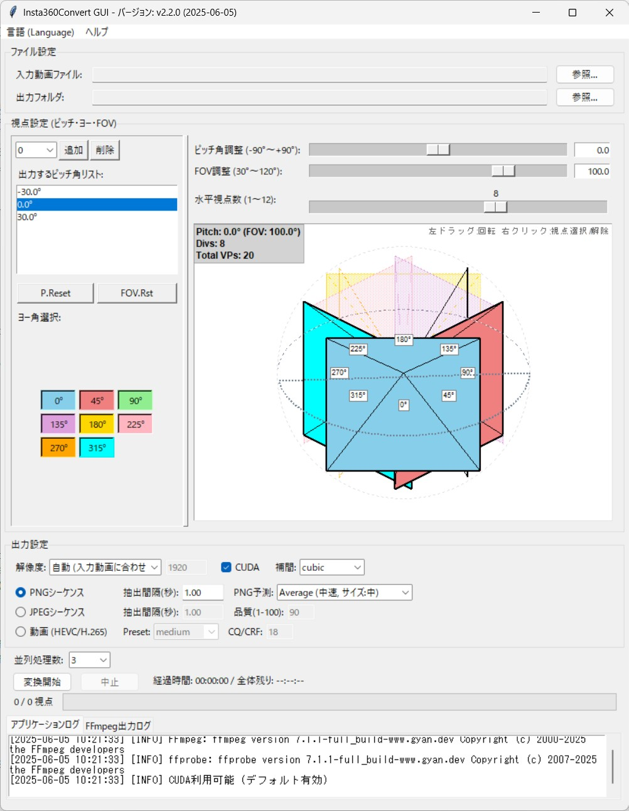

# Insta360Convert GUI

**Insta360Convert GUI** is a user-friendly desktop application designed to extract multiple defined perspective views (defined by pitch, yaw, and Field of View) from 360° equirectangular videos and export them as video clips or image sequences. It's a versatile tool for photogrammetry, VR content creation, visual effects, and various other video production workflows.

**⚠️ Important Prerequisites: This application requires Python and FFmpeg to be installed on your system. Please see the "Requirements" section below for details.**

**[日本語]**
**Insta360Convert GUI** は、360°動画 (エクイレクタングラー形式)から、指定した複数の視点(ピッチ角、ヨー角、視野角)を切り出して、動画または静止画シーケンスとして出力するためのGUIアプリケーションです。フォトグラメトリやVRコンテンツ制作、映像作品の素材作成など、幅広い用途にご利用いただけます。

**⚠️ 事前の重要事項: このアプリケーションを使用するには、お使いのシステムに Python と FFmpeg がインストールされている必要があります。詳細は下記の「1. 準備するもの」セクションをご覧ください。**

## Downloads / ダウンロード

You can download the latest version (including source code and helper scripts) from the [**Releases page**](https://github.com/stechdrive/Insta360Convert-GUI/releases/latest).

[日本語] 最新バージョン（ソースコードや補助スクリプトを含む）は [**リリースページ**](https://github.com/stechdrive/Insta360Convert-GUI/releases/latest) からダウンロードできます。

## IMPORTANT: Regarding Videos Shot with Insta360 Cameras

Videos in proprietary formats (e.g., .insv) shot with Insta360 cameras **must first be exported as a "360° Video" using Insta360's official app (Studio or mobile app)**. This process converts the video into an equirectangular format (usually .mp4), which is the required input format for this tool.

**What is Equirectangular Format?**
It's a format where the entire 360° spherical view is projected onto a flat 2D image or video frame, similar to how a world map (like the Mercator projection) flattens the Earth's surface into a rectangle. This format typically exhibits significant distortion towards the top and bottom and is the standard input for many 360° video editing and conversion tools.

**[日本語]**
**【重要】Insta360 カメラで撮影した動画について:**
Insta360 カメラで撮影した独自の形式 (.insv など)の動画は、まず Insta360 の公式アプリ (Studio またはモバイルアプリ)を使用して「360°動画」としてエクスポートし、エクイレクタングラー形式の動画ファイル(通常は.mp4) に変換しておく必要があります。このツールは、そのようにしてエクスポートされたエクイレクタングラー形式の動画を入力として扱います。

**エクイレクタングラー形式とは?**
360°全方位の映像を、一枚の平面画像(または動画フレーム)に展開した形式です。地図の世界地図(メルカトル図法など)のように、球体の表面を長方形に引き伸ばしたもので、上下方向の歪みが大きい特徴があります。この形式が、多くの360°動画編集や変換ツールの標準的な入力形式となっています。

---

## Features

*   **Interactive Viewpoint Setup:** Define pitch, yaw, and FOV for multiple viewpoints using the advanced 3D-like selector.
*   **Per-Pitch FOV:** Set a custom Field of View for each selected pitch angle.
*   **Flexible Output:** Export as MP4 (H.265/HEVC) video clips or PNG/JPEG image sequences.
*   **CUDA Acceleration:** Supports NVIDIA CUDA for hardware-accelerated decoding and encoding (with compatibility testing for high-resolution inputs).
*   **Batch Processing:** Process all defined viewpoints in parallel.
*   **Version & Update Check:** Displays the current application version and allows checking for newer versions directly from GitHub.
*   **Cross-Platform:** Built with Python and Tkinter, designed to work on Windows, macOS, and Linux (with dependencies met).
*   **Detailed Logging:** Application and FFmpeg logs are available in separate tabs for easy troubleshooting.

**[日本語] 主な機能**
*   **インタラクティブな視点設定:** 高度な3D風セレクタを使用して、複数の視点のピッチ、ヨー、FOVを定義。
*   **ピッチごとのFOV設定:** 選択した各ピッチ角に対してカスタムFOVを設定可能。
*   **柔軟な出力形式:** MP4 (H.265/HEVC) 動画または PNG/JPEG 静止画シーケンスとして出力。
*   **CUDAアクセラレーション:** NVIDIA CUDAによるハードウェアアクセラレーションに対応（高解像度入力時の互換性テスト付き）。
*   **バッチ処理:** 定義された全ての視点を並列処理。
*   **バージョン表示とアップデート確認:** 現在のアプリケーションバージョンを表示し、GitHubから新しいバージョンを確認する機能。 
*   **クロスプラットフォーム:** PythonとTkinterで構築され、Windows, macOS, Linuxで動作（依存関係充足時）。
*   **詳細ログ:** アプリケーションログとFFmpegログを別タブで確認可能。

---

## Screenshots

---

## 1. Requirements

To use this application, you will need the following software and files:

*   **Python:** Python 3.x (e.g., 3.7 or newer) must be installed on your PC.
    *   See "Appendix 2: How to Install Python" below for installation guidance.
*   **FFmpeg:** The video and audio processing library FFmpeg (and `ffprobe`, which is usually included) is required.
    *   See "Appendix 1: How to Install FFmpeg" below for installation guidance.
    *   **IMPORTANT:** The folder containing the FFmpeg executables (`ffmpeg.exe`, `ffprobe.exe`, etc.) must be added to your system's PATH environment variable.
*   **Application Files:**
    *   `insta360convert.py` (Main application launch script)
    *   `gui_app.py` (Main GUI application class)
    *   `advanced_yaw_selector.py` (Viewpoint setting UI module)
    *   `ffmpeg_worker.py` (FFmpeg processing worker script)
    *   `constants.py` (Configuration values definition file)
    *   `tooltip_utils.py` (Tooltip display utility)
    *   `update_checker.py`(Check GitHub Latest Relese)
    *   `insta360convert.bat` (Optional, simple launch batch file for Windows)

    All these Python files (`.py`) and the batch file (`.bat`, if used) should be placed in the **same folder**.

**[日本語] 1. 準備するもの**

このアプリケーションを使用するには、以下のソフトウェアとファイルが必要です。

*   **Python:** お使いの PC に Python 3.x (例: 3.7以降) がインストールされている必要があります。
    *   導入方法は後述の「補足 2: Python の導入方法」を参照してください。
*   **FFmpeg:** 動画・音声処理ライブラリである FFmpeg (および通常同梱されている `ffprobe`) が必要です。
    *   導入方法は後述の「補足 1: FFmpeg の導入方法」を参照してください。
    *   **重要:** FFmpeg の実行ファイル (ffmpeg.exe, ffprobe.exe など)が含まれるフォルダに、システムの環境変数 PATH を通す必要があります。
*   **アプリケーションファイル群:**
    *   `insta360convert.py` (アプリケーションのメイン起動スクリプト)
    *   `gui_app.py` (GUI アプリケーションのメインクラス)
    *   `advanced_yaw_selector.py` (視点設定 UI モジュール)
    *   `ffmpeg_worker.py` (FFmpeg 処理ワーカースクリプト)
    *   `constants.py` (設定値定義ファイル)
    *   `tooltip_utils.py` (ツールチップ表示ユーティリティ)
    *   `update_checker.py`(GitHubに最新バージョンがあるか確認する)
    *   `insta360convert.bat` (Windows 用の簡単起動バッチファイル、任意)

    これらのファイルはすべて同じフォルダ内に配置してください。

---

## 2. Launching the Application

There are a couple of ways to launch the application:

**Method 1: Using the Batch File (Windows Recommended)**

1.  Ensure all the `.py` files listed in "Application Files" and `insta360convert.bat` are in the same folder.
2.  Double-click `insta360convert.bat`.
3.  A command prompt window might briefly appear, but the GUI application window should launch shortly after.
    *This batch file is configured to help avoid character encoding issues and run the Python script in the background.*

**Method 2: Running Directly from Command Prompt or Terminal**

1.  Open the folder where the "Application Files" are saved.
2.  Open a Command Prompt or Terminal in that folder:
    *   **Windows:** Type `cmd` in the folder's address bar and press Enter. Alternatively, Shift + Right-click in the folder and select "Open PowerShell window here" or "Open command prompt here".
3.  In the Command Prompt or Terminal, type `python insta360convert.py` and press Enter.
4.  The GUI application window will launch.

**[日本語] 2. アプリケーションの起動**

アプリケーションを起動するには、いくつかの方法があります。

**方法1: バッチファイルを使用する (Windows 推奨)**

1.  上記「アプリケーションファイル群」でリストされた全ての.py ファイルと `insta360convert.bat` ファイルが、同じフォルダ内に保存されていることを確認します。
2.  `insta360convert.bat` ファイルをダブルクリックします。
3.  一瞬コマンドプロンプトのウィンドウが表示される場合がありますが、すぐに GUI アプリケーションのウィンドウが起動します。
    *このバッチファイルは、文字コードの問題を回避し、Python スクリプトをバックグラウンドで実行するように設定されています。*

**方法2: コマンドプロンプトまたはターミナルから直接実行する**

1.  上記「アプリケーションファイル群」が保存されているフォルダを開きます。
2.  そのフォルダ内でコマンドプロンプトまたはターミナルを開きます。
    *   **Windows の場合:** フォルダのアドレスバーに `cmd` と入力して Enter キーを押すか、フォルダ内で Shift キーを押しながら右クリックし、「PowerShell ウィンドウをここで開く」または「コマンドプロンプトをここで開く」を選択します。
3.  コマンドプロンプトまたはターミナルに `python insta360convert.py` と入力して実行します。
4.  GUI アプリケーションのウィンドウが起動します。

---

## 3. Quick Start Guide

To start converting quickly with default-like settings:

1.  **Select Input Video File:** In the "File Settings" section at the top, click the "Browse..." button next to "Input Video File" and select your 360° video file (already exported to equirectangular format).
2.  **Check Output Folder:** When an input video is selected, the same folder is automatically set as the output destination. If you want to change it, use the "Browse..." button next to "Output Folder".
3.  **Review Viewpoint Settings:** By default, for a 0° pitch angle, 8 viewpoints (yaw angles 0°, 45°, ..., 315°) are selected, and the FOV for each is set to 100°. Adjust as needed in the "Viewpoint Settings (Pitch/Yaw/FOV)" section.
4.  **Check Output Format:** "PNG Sequence" is selected by default. If you prefer video or JPEG output, change this in the "Output Settings" section.
5.  **Start Conversion:** Click the "Start Conversion" button at the bottom of the window.

Processing will begin with settings close to the defaults. For more detailed configuration, refer to "4. Main Interface and Settings" below. Many UI elements display a tooltip with a brief explanation when you hover the mouse cursor over them.

**[日本語] 3. クイックスタートガイド(最短手順)**

すぐに変換を開始したい場合は、以下の手順を実行します。

1.  **入力動画ファイルを選択:** ウィンドウ上部の「ファイル設定」セクションにある「入力動画ファイル」の右の「参照...」ボタンを押し、変換したい 360°動画ファイル(エクイレクタングラー形式にエクスポート済みのもの)を選択します。
2.  **出力フォルダを確認:** 入力動画を選択すると、自動的に同じフォルダが出力先に設定されます。変更したい場合のみ、「出力フォルダ」の「参照...」ボタンで変更します。
3.  **視点設定を確認:** デフォルトでは、ピッチ角 0°に対して水平方向に8分割された視点(ヨー角0°, 45°, ..., 315°)が選択され、各視点の FOV は 100°に設定されています。必要に応じて、「視点設定(ピッチ・ヨー・FOV)」セクションで調整します。
4.  **出力形式を確認:** デフォルトでは「PNG シーケンス」が選択されています。動画で出力したい場合や、JPEG で出力したい場合は、「出力設定」セクションで変更します。
5.  **変換開始:** ウィンドウ下部にある「変換開始」ボタンをクリックします。

これで、デフォルト設定に近い形で処理が開始されます。詳細な設定を変更したい場合は、次の「4. 操作画面と設定項目」を参照してください。多くの UI 要素にマウスカーソルを合わせると、簡単な説明がツールチップとして表示されますので、そちらも参考にしてください。

---

## 4. Main Interface and Settings

**4.1. File Settings**  

*   **Input Video File:**
    *   Click "Browse..." to select the 360° video file (.mp4, .mov, etc., in equirectangular format).
    *   Upon selection, video resolution, duration, and FPS are read and displayed in the "Application Log" tab.
*   **Output Folder:**
    *   Specify the folder for the output files.
    *   Automatically set to the input video's folder upon input selection; can be changed using "Browse...".

**4.2. Viewpoint Settings (Pitch/Yaw/FOV)**

This entire section is provided by the "Advanced Yaw Selector" module.

**Left Panel:**  
*   **Add/Remove Pitch Angle:**
    *   Select a pitch angle from the dropdown list and click "Add" to add it to the "Output Pitch Angle List". Up to 7 pitch angles can be registered.
    *   Click "Remove" to delete the currently selected pitch angle from the list (at least one must remain).
*   **Output Pitch Angle List:**
    *   Displays currently configured pitch angles. Selecting an item in this list updates the right-side controls and 3D preview with its detailed settings (pitch value, FOV, number of yaw divisions, yaw selections).
*   **Reset Buttons:**
    *   "P.Reset": Resets the pitch angle list to the default settings (e.g., -30,0,30 degrees).
    *   "FOV.Rst": Resets the FOV of the currently selected pitch angle to its default value (100 degrees).
*   **Yaw Selection Buttons:**
    *   Displays buttons for yaw angles based on the "Number of Horizontal Viewpoints" set for the currently selected pitch.
    *   Clicking each button toggles the corresponding yaw angle for output (on/off). The button color corresponds to the viewpoint color in the 3D preview.

**Right Panel:**

*   **Pitch Angle Adjust Slider/Entry:**
    *   Adjust the precise value of the selected pitch angle from the list using the slider or by numerical input (-90° to +90°). Changes are reflected in the list.
*   **FOV Adjust Slider/Entry:**
    *   Adjust the Field of View (FOV) for the selected pitch angle using the slider or numerical input (30° to 120°).
    *   *For photogrammetry, an FOV around 90°-100° often provides a good balance between distortion and overlap, but adjust based on the subject and shooting method.*
*   **Number of Horizontal Viewpoints Slider:**
    *   For the selected pitch angle, specify how many viewpoints (yaw angles) to generate horizontally (how many divisions of a circle) within a range of 1 to 12.
    *   Changing this value resets all yaw selections for that pitch to "selected", and the yaw selection button group below it is updated.
*   **3D Preview Canvas:**
    *   Visually displays the current viewpoint settings on a 3D sphere.
    *   **Controls:**
        *   **Left-drag:** Rotate the sphere to view from different angles.
        *   **Right-click (empty space):** Toggle selection of the viewpoint visually closest to the click location.
        *   **Right-click (viewpoint label):** Toggle selection of the specific yaw angle associated with the label.
    *   **Display:**
        *   Selected viewpoints are shown as colored cones (pyramid-shaped) representing the FOV. Colors correspond to the yaw buttons.
        *   FOV planes of unselected viewpoints may be shown semi-transparently or as outlines.
        *   The top-left corner displays info: current pitch, its FOV, number of divisions, and total selected viewpoints.
        *   A simple operation guide ("Left-drag:Rotate Right-click:Toggle VP") is shown in the top-right.
        *   An equator line for the current pitch is drawn as a dotted line on the sphere.

**4.3. Output Settings**  

*   **Resolution:**
    *   Specifies the side length (in pixels) of the square output images/videos.
    *   Default is "Automatic (match input video)", which uses the shorter dimension of the input video (e.g., 3840 for an 8K Insta360 video like 7680x3840).
    *   Select "1920", "1600", or "Custom..." from the dropdown.
    *   If "Custom..." is selected, the entry field to its right becomes active for numerical input (e.g., 1024).
    *   *【Resolution and Processing Load】 Generating many high-resolution images significantly increases processing time and memory consumption for subsequent photogrammetry software. While higher resolution is generally desirable, testing with lower resolutions first is recommended.*
*   **CUDA (Hardware Acceleration):**
    *   Check this to use a compatible NVIDIA GPU (CUDA) to accelerate decoding and encoding.
    *   The application auto-detects CUDA availability on startup. If available, it's checked by default. If not, the checkbox is disabled.
    *   For high-resolution input videos (width or height exceeding 4096 pixels), a compatibility test is run at the start of conversion if CUDA is enabled. If the test fails or issues are detected, it automatically falls back to CPU processing.
    *   If you encounter issues even when CUDA is available, try unchecking this option.
*   **Interpolation Method:**
    *   Selects the image interpolation method used when extracting views. Affects quality and processing speed.
    *   Default is "cubic".
    *   **Options:**
        *   `cubic`: Good balance of sharpness and smoothness (Recommended).
        *   `lanczos`: Highest quality, very sharp, but computationally intensive and can occasionally produce ringing artifacts.
        *   `linear`: Standard quality and speed.
        *   `nearest`: Fastest, but lowest quality (prone to blockiness and aliasing).
*   **Output Format Radio Buttons and Options:**
    *   *【Recommended】 For photogrammetry software (e.g., Reality Capture), selecting "PNG Sequence" is recommended.*
        *   **PNG Sequence:**
            *   Outputs still image files in PNG format (lossless compression, high quality).
        *   **Extraction Interval (sec):** Specify how often to extract a still image (e.g., `0.5` for 2 frames per second, `1.00` for 1 frame per second). Input in 0.01 second increments. Default is `1.00` sec.
            *   *【Adjustment Tip】 Adjust based on the speed of motion in the video and the subject. Too short an interval creates an excessive number of images and increases load; set it as long as possible while still capturing necessary information.*
        *   **PNG Prediction:** Selects the prediction filter for PNG encoding, a trade-off between encoding speed and file size. Default is "Average (medium speed, medium size)".
        *   **JPEG Sequence:**
            *   Outputs still image files in JPEG format. Lossy compression, smaller file sizes, but lower quality than PNG.
            *   **Extraction Interval (sec):** Same as for PNG.
            *   **Quality (1-100):** Specify JPEG quality from 1 (low quality, small size) to 100 (high quality, large size). Default is `90`.
        *   **Video (HEVC/H.265):**
            *   Outputs each viewpoint as an individual video file (H.265 codec, MP4 container). Audio is not included.
            *   **Preset:** Specifies the encoding speed vs. compression balance (e.g., `medium`, `slow`). Default is `medium`.
            *   **CQ/CRF:** Specifies the encoding quality. Lower values mean higher quality (and larger files). Range 0-51, typically 15-28. Default is `18`. (Handled as CQ for CUDA, CRF for CPU).

**4.4. Controls and Progress**  

*   **Parallel Processes:**  Specify the number of viewpoints to process simultaneously (number of FFmpeg processes). Selectable from 1 up to the number of logical CPU cores on your PC. The default value is automatically set based on the total number of pitch angles in the "Output Pitch Angle List" (capped by the PC's logical core count). This default updates if you change the number of pitch angles. Increasing this may speed up processing but also increases CPU load and memory usage. The optimal value varies by environment; manual adjustment may be beneficial.  

*   **Start Conversion Button:** After confirming all settings, click this to begin the conversion process.
*   **Cancel Button:** Click this during conversion to interrupt the process.
*   **Time Display:** During conversion, displays "Elapsed Time" and "Overall Remaining" time.
        *   "Elapsed Time": Total time since conversion started.
        *   "Overall Remaining": Estimated time until all viewpoints are processed (updated after each task completion, considering average processing time, remaining tasks, and current parallel processing).
*   **Viewpoint Progress Display:** To the left of the progress bar, shows progress in the format "(Processed Viewpoints)/(Total Viewpoints) Viewpoints".
*   **Progress Bar:** Visually indicates the overall conversion progress.
*   **Log Area (Tabbed):**  A switchable text area at the bottom of the window.
    *   **Application Log Tab:** Displays start/completion messages, settings, messages from the application, error information, etc.
    *   **FFmpeg Output Log Tab:** Displays detailed messages from FFmpeg during command execution (version info, encoding progress, etc.). Useful for in-depth troubleshooting if problems occur.  

**4.5. Menu Bar**

The application window includes a menu bar at the top (typically "Help" on Windows/Linux, or integrated into the system menu bar on macOS).

*   **Help Menu:**
    *   **About:** Displays information about the application, including the current version number.
    *   **Check for Updates...:** Connects to the GitHub repository to check if a newer version of Insta360Convert GUI is available. If an update is found, it will inform you and provide an option to open the releases page in your web browser.

**[日本語] 4. 操作画面と設定項目**

**4.1. ファイル設定**  
*   **入力動画ファイル:**
    *   「参照...」からエクイレクタングラー形式の360°動画ファイル(.mp4, .mov等)を選択。
    *   選択すると、動画の解像度、再生時間、FPSが読み込まれ「アプリケーションログ」に表示。
*   **出力フォルダ:**
    *   変換後のファイルの出力先を指定。
    *   入力動画選択時に同じフォルダが自動設定。変更は「参照...」から。

**4.2. 視点設定(ピッチ・ヨー・FOV)**  
    このセクションは「Advanced Yaw Selector」モジュールで提供。

**左側パネル:**  
*   **ピッチ角追加/削除:**
    *   ドロップダウンからピッチ角を選び「追加」でリストに追加（最大7個）。
    *   「削除」でリストから選択中のピッチ角を削除（最低1つは残る）。
*   **出力するピッチ角リスト:**
    *   設定済みのピッチ角を表示。選択すると右側のコントロールと3Dプレビューに詳細設定（ピッチ値、FOV、水平視点数、ヨー角選択）が反映。
*   **リセットボタン:**
    *   「P.Reset」: ピッチ角リストをデフォルト（例: -30,0,30度）にリセット。
    *   「FOV.Rst」: 選択中ピッチ角のFOVをデフォルト値（100度）にリセット。
*   **ヨー角選択ボタン:**
    *   選択中ピッチ角の「水平視点数」に基づきヨー角ボタンを表示。
    *   クリックで対応ヨー角の選択(オン)/非選択(オフ)を切替。ボタン色は3Dプレビューの視点色と連動。

**右側パネル:**
*   **ピッチ角調整スライダー/入力欄:**
    *   選択中ピッチ角の値をスライダーまたは数値入力で調整(-90°~+90°)。変更はリストにも反映。
*   **FOV 調整スライダー/入力欄:**
    *   選択中ピッチ角の視野角(FOV)をスライダーまたは数値入力で調整(30°~120°)。
    *   *フォトグラメトリ用途では、90°~100°程度が歪みとオーバーラップのバランスが良いとされますが、対象物や撮影方法によって調整してください。*
*   **水平視点数スライダー:**
    *   選択中ピッチ角に対し、水平方向の視点(ヨー角)を何分割で生成するかを1~12で指定。
    *   値を変更すると、そのピッチ角のヨー角は全選択状態になり、ヨー角選択ボタン群も更新。
*   **3D プレビューキャンバス:**
    *   現在の視点設定を3D球体上に表示。
    *   **操作:**
        *   左ドラッグ: 球体を回転。
        *   右クリック(何もない空間): クリック位置に最も近い視点の選択/非選択をトグル。
        *   右クリック(視点ラベル): ラベルのヨー角の選択/非選択をトグル。
    *   **表示:**
        *   選択視点はFOVを表す錐体(ピラミッド型)として色付き表示（色はヨー角ボタンと連動）。
        *   非選択視点のFOV平面は半透明または輪郭のみ表示。
        *   左上に現在の選択ピッチ、FOV、水平分割数、総視点数を表示。
        *   右上に「左ドラッグ:回転 右クリック:視点選択/解除」の操作ガイド表示。
        *   球体上に現在選択ピッチの赤道線を点線描画。

**4.3. 出力設定**

*   **解像度:**
    *   出力する正方形の画像/動画の一辺のピクセル数を指定。
        *   デフォルト「自動(入力動画に合わせる)」(入力動画の短辺解像度を使用。例: Insta360 8K動画(7680x3840)→3840)。
        *   「1920」「1600」「カスタム...」を選択可能。
        *   「カスタム...」選択時、右隣の入力欄が有効化(例: 1024)。
        *   *【解像度と処理負荷について】高解像度で多数の画像を生成すると、後続のフォトグラメトリソフト等での処理時間やメモリ消費量が増大します。可能な限り高解像度が望ましいですが、事前に低解像度でテストすることを推奨します。*
*   **CUDA (ハードウェアアクセラレーション):**
    *   チェックすると対応NVIDIA GPU(CUDA)でデコード/エンコード処理を高速化。
    *   起動時にCUDA利用可否を自動検出し、可能な場合はデフォルトでオン。不可なら無効。
    *   高解像度(幅or高さが4096px超)入力動画でCUDA使用時、変換開始時に互換性テストを実行。失敗や問題検出時は自動的にCPU処理にフォールバック。
    *   利用可能な場合でも問題発生時はチェックを外してください。
         
*   **補間(補間方法):**
    *   視点切り出し時の画像補間方法を選択。画質と処理速度に影響。
    *   デフォルト「cubic」。
    *   **選択肢:**
        *   `cubic`: 高画質でシャープネスと滑らかさのバランス良(推奨)。
        *   `lanczos`: 最高画質クラスでシャープだが重く稀にリンギング発生。
        *   `linear`: 標準的な品質と速度。
        *   `nearest`: 最も高速だが画質最低(ブロックノイズやジャギーが出やすい)。
*   **出力形式ラジオボタンとオプション:**
*   *【推奨】フォトグラメトリソフト(Reality Capture等)で使用する場合、「PNGシーケンス」を推奨。*
*   **PNG シーケンス(静止画シーケンス (PNG)):**
    *   PNG形式の静止画ファイルを出力（可逆圧縮で高画質）。
        *   **抽出間隔(秒):** 何秒ごとに1枚静止画を切り出すか指定(例: `0.5`→毎秒2枚, `1.00`→毎秒1枚)。0.01秒単位。デフォルト`1.00`秒。
        *   *【調整のヒント】動画撮影時の移動速度や対象に合わせて調整。短すぎると画像枚数が膨大になり処理負荷増大。必要な情報が得られる範囲で長めに設定推奨。*
        *   **PNG予測:** PNGエンコード時の予測フィルター選択。速度とファイルサイズのトレードオフ。デフォルト「Average (中速,サイズ:中)」。
    *   **JPEG シーケンス(静止画シーケンス (JPEG)):**
        *   JPEG形式の静止画ファイルを出力（非可逆圧縮でファイルサイズは抑えられるが画質はPNGに劣る）元の動画の状態や求める品質がある程度でいい場合、ドラフトの場合など十分にアリ。
        *   **抽出間隔(秒):** PNGと同様。
        *   **品質(1-100):** JPEG品質を1(低品質・小)～100(高品質・大)で指定。デフォルト`90`。
    *   **動画(HEVC/H.265):**
        *   各視点を個別の動画ファイル(H.265コーデック, MP4コンテナ)として出力。音声なし。
        *   **Preset:** エンコード速度と品質のバランス指定(例: `medium`, `slow`)。デフォルト`medium`。
        *   **CQ/CRF:** エンコード品質指定。数値が低いほど高品質(ファイルサイズ大)。0～51の範囲、通常15～28程度。デフォルト`18`(CUDAはCQ, CPUはCRFとして扱われる)。

**4.4. コントロールと進捗**
*   **並列処理数:** 同時に処理する視点の数(FFmpegプロセス数)を指定。PCのCPUコア数に応じ1から最大論理コア数まで選択可。デフォルト値は「出力するピッチ角リスト」のピッチ角総数(PC論理コア数上限)に自動設定され、ピッチ角数変更に追随。値を大きくすると処理が速くなる可能性があるがCPU負荷やメモリ使用量が増加。最適値は環境依存のため手動調整も可。
*   **変換開始ボタン:** 全設定確認後、クリックで変換処理開始。
*   **中止ボタン:** 変換処理中にクリックで処理中断。
*   **時間表示:** 変換中、「経過時間」「全体残り」形式で表示。
    *   「経過時間」: 変換開始からの総経過時間。
    *   「全体残り」: 全視点処理完了までの推定残り時間(タスク完了毎に平均処理時間、残りタスク数、現在並列処理数を考慮し更新)。
*   **視点数進捗表示:** プログレスバー左に「(処理済み視点数)/(全視点数)視点」形式で表示。
*   **プログレスバー:** 全体変換処理の進捗状況を視覚的に表示。
*   **ログエリア(タブ形式):** ウィンドウ下部のタブ切替可能なテキストエリア。
    *   **アプリケーションログタブ:** 処理開始/完了、設定内容、アプリからのメッセージ、エラー情報等表示。
    *   **FFmpeg出力ログタブ:** FFmpegコマンド実行時の詳細メッセージ(バージョン情報、エンコード進捗等)表示。問題発生時の詳細調査に役立つ。

**4.5. メニューバー**  
アプリケーションウィンドウの上部にはメニューバーがあります (Windows/Linuxでは通常「ヘルプ」、macOSではシステムメニューバーに統合)。

*   **ヘルプメニュー:**
    *   **バージョン情報:** アプリケーションの現在のバージョン情報などを表示します。
    *   **アップデートを確認...:** GitHubリポジトリに接続し、Insta360Convert GUIの新しいバージョンが利用可能かどうかを確認します。アップデートが見つかった場合は通知し、リリーススページをウェブブラウザで開くオプションを提供します。

---

## 5. Output Results

When processing is successfully completed, the "Start Conversion" button becomes pressable again. The "Application Log" tab will display a message like "All conversion processes have completed," and the viewpoint progress will show "(Total Viewpoints)/(Total Viewpoints) Viewpoints (Conversion Complete)".

Folders (for image sequences) or files (for videos) with names like the following will be created in the specified "Output Folder":

*   **For Image Sequences:**
    *   A subfolder named `[OriginalVideoFileName]_pXXX_yYYY` is created for each viewpoint combination (XXX is the 3-digit pitch angle, with a minus sign replaced by 'm'; YYY is the 3-digit yaw angle. Examples: `p000_y045`, `pm30_y120`).
    *   Inside each subfolder, sequentially numbered image files named `[OriginalVideoFileName]_pXXX_yYYY_NNNNN.png` (or `.jpg`) are saved.
*   **For Videos:**
    *   A video file named `[OriginalVideoFileName]_pXXX_yYYY.mp4` is created for each viewpoint combination (XXX format is the same as for image sequences).

**[日本語] 5. 出力結果**

処理が正常に完了すると、「変換開始」ボタンが再び押せるようになります。「アプリケーションログ」タブには「全ての変換処理が完了しました。」というメッセージが表示され、視点数進捗も「(全視点数)/(全視点数) 視点 (変換完了)」となります。

指定した「出力フォルダ」内に、以下のような名前のフォルダ (静止画の場合)またはファイル(動画の場合)が作成されます。

*   **静止画の場合:**
    *   元の動画ファイル名_pXXX_yYYY という名前のサブフォルダが、指定した視点の組み合わせごとに作成されます (XXX はピッチ角3桁で、マイナス記号は m に置換されます。YYY はヨー角3桁。例:p000_y045, pm30_y120)。
    *   各サブフォルダの中に、元の動画ファイル名_pXXX_yYYY_NNNNN.png (または.jpg)という名前で連番の静止画ファイルが保存されます。
*   **動画の場合:**
    *   元の動画ファイル名_pXXX_yYYY.mp4 という名前の動画ファイルが、指定した視点の組み合わせごとに作成されます (XXX はピッチ角のマイナス記号は m に置換)。

---

## 6. If an Error Occurs

If an error occurs during processing, the "Start Conversion" button will become pressable again. The "Application Log" tab will display an error message and details of the error (such as messages from FFmpeg). Check the log content to identify the cause of the error. The viewpoint progress might show "(Error)". Detailed FFmpeg error messages can be found in the "FFmpeg Output Log" tab.

**[日本語] 6. エラーが発生した場合**

もし処理中にエラーが発生すると、「変換開始」ボタンが再び押せる状態に戻ります。「アプリケーションログ」タブにはエラーメッセージと、エラーの詳細 (FFmpeg からのメッセージなど)が表示されます。ログの内容を確認し、エラーの原因を特定してください。視点数進捗には「(エラー)」と表示されることがあります。詳細な FFmpeg のエラーメッセージは「FFmpeg 出力ログ」タブで確認できる場合があります。

---

## Appendix 1: How to Install FFmpeg

This application uses FFmpeg internally. Please prepare it using the following steps:

1.  **Download:** Download a build for your OS from the official FFmpeg website ([https://ffmpeg.org/download.html](https://ffmpeg.org/download.html)) or other trusted sources.
    *   For Windows, builds from gyan.dev or BtbN are common. Choose a `full_build` or `essentials_build` zip file.
2.  **Extract:** Extract the downloaded zip file to a location of your choice on your PC (e.g., `C:\ffmpeg`).
3.  **Add to Environment Variable PATH (Crucial):**
    1.  Copy the full path to the `bin` folder inside the extracted FFmpeg folder (e.g., `C:\ffmpeg\bin`).
    2.  In the Windows search bar, type "environment variables" and open "Edit the system environment variables".
    3.  Click the "Environment Variables..." button.
    4.  Under "System variables" (or "User variables for [Your Username]"), find and select the "Path" variable, then click "Edit...".
    5.  Click "New" and paste the copied path to the `bin` folder.
    6.  Click "OK" on all dialog windows to close them.
4.  **Verify:** Open a new Command Prompt or Terminal and type `ffmpeg -version`. If FFmpeg version information is displayed, the setup is successful.

**[日本語] 補足 1: FFmpeg の導入方法**

このアプリケーションは内部で FFmpeg というツールを使用します。以下の手順で準備してください。

1.  **ダウンロード:** FFmpeg 公式サイト (https://ffmpeg.org/download.html)などから、お使いの OS 向けのビルドをダウンロードします。
    *   Windows の場合: gyan.dev や BtbN のビルドが一般的です。full_build または essentials_buildのzip ファイルを選びます。
2.  **展開(解凍):** ダウンロードした zip ファイルを、PC 内の任意の場所 (例: C:\ffmpeg)に展開 (解凍)します。
3.  **環境変数 PATH への追加 (重要):**
    1.  展開したフォルダの中にある bin フォルダ (例: C:\ffmpeg\bin) のフルパスをコピーします。
    2.  Windows の検索バーで「環境変数」と入力し、「システム環境変数の編集」を開きます。
    3.  「環境変数(N)...」ボタンをクリックします。
    4.  「システム環境変数(S)」または「(あなたのユーザー名)のユーザー環境変数(U)」のリストから「Path」を選択し、「編集(E)...」をクリックします。
    5.  「新規(N)」をクリックし、コピーした bin フォルダのパスを貼り付けます。
    6.  「OK」ボタンを何度かクリックして、すべてのダイアログを閉じます。
4.  **確認:** 新しくコマンドプロンプトまたはターミナルを開き、`ffmpeg -version` と入力して Enter キーを押します。FFmpeg のバージョン情報が表示されれば、設定は成功です。

---

## Appendix 2: How to Install Python

Python is required to run this application.

1.  **Download:** Download the latest stable installer from the official Python website ([https://www.python.org/downloads/](https://www.python.org/downloads/)) (e.g., "Windows installer (64-bit)" for Windows).
2.  **Install (Recommended settings for Windows):**
    1.  Run the downloaded installer.
    2.  On the first screen of the installer, **DO NOT** check the "Add Python X.X to PATH" checkbox (this is to avoid conflicts if managing multiple Python versions and to encourage using the `py` launcher).
    3.  On the same screen, select "Customize installation".
    4.  On the "Optional Features" screen, ensure "py launcher" is checked, then click "Next".
    5.  On the "Advanced Options" screen, it is **strongly recommended** to check "Install py launcher for all users (requires elevation)". This makes the `py` command available system-wide from the command prompt and ensures reliable launching from batch files. (This option requires administrator privileges).
    6.  Change the installation folder if desired, then click "Install" to begin.
3.  **Verify:** Open a Command Prompt or Terminal and type `py --version` (for Windows) or `python3 --version` (for macOS/Linux) and press Enter. If the installed Python version is displayed, the setup is successful.

**[日本語] 補足 2: Python の導入方法**

このアプリケーションを実行するには Python が必要です。

1.  **ダウンロード:** Python 公式サイト (https://www.python.org/downloads/) から、最新の安定版インストーラー (Windows の場合は "Windows installer (64-bit)" など) をダウンロードします。
2.  **インストール (Windows の場合の推奨設定):**
    1.  ダウンロードしたインストーラーを実行します。
    2.  インストーラーの最初の画面で、「Add Python X.X to PATH」のチェックボックスはチェックしないでください(複数の Python バージョンを管理する場合に競合を避けるため、また、py ランチャーの使用を推奨するため)。
    3.  同じ画面で「Customize installation」を選択します。
    4.  次の「Optional Features」画面で、「py launcher」にチェックが入っていることを確認し、「Next」をクリックします。
    5.  次の「Advanced Options」画面で、「Install py launcher for all users (requires elevation)」(または類似の日本語表記「すべてのユーザー用に pyランチャーをインストールする(管理者権限が必要)」)にチェックを入れることを強く推奨します。これにより、コマンドプロンプトで py コマンドがシステム全体で利用可能になり、バッチファイルからの起動が確実になります。(このオプションには管理者権限が必要です。)
    6.  必要に応じてインストール先フォルダを変更し、「Install」をクリックしてインストールを開始します。
3.  **確認:** コマンドプロンプトまたはターミナルを開き、`py --version` (Windows の場合)または `python3 --version` (macOS/Linux の場合)と入力して Enter キーを押します。インストールした Python のバージョンが表示されれば、設定は成功です。

---

## License

This project is licensed under the **MIT License**. See the `LICENSE` file for details.

**[日本語] ライセンス**

このプロジェクトは **MIT License** の下にライセンスされています。詳細は `LICENSE` ファイルをご覧ください。

---